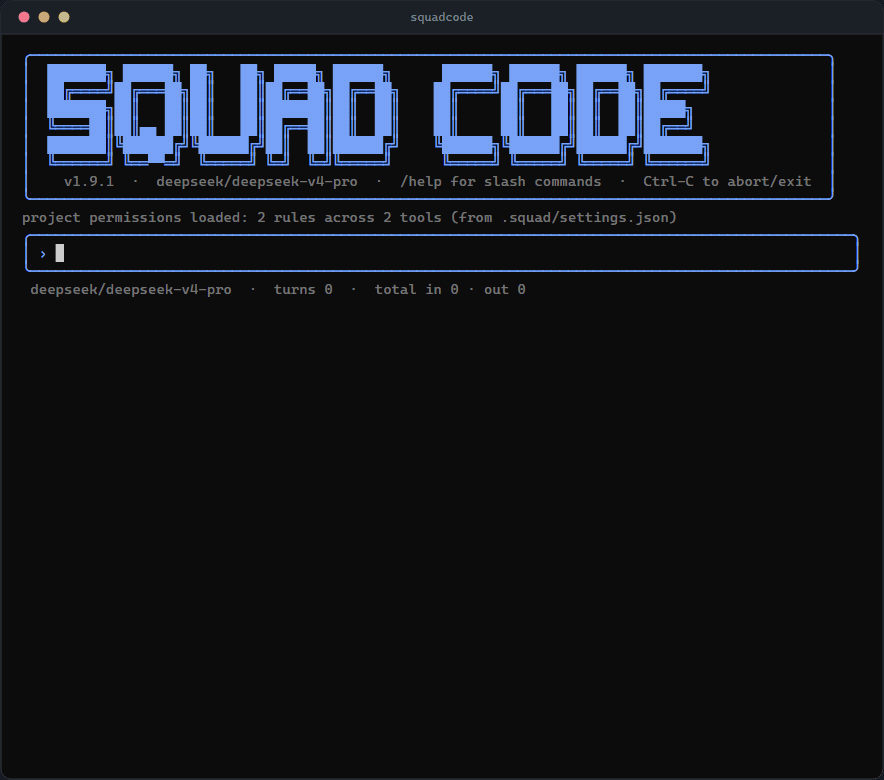

# Squad Code

A provider-neutral CLI agent for vetting local and frontier models on the same tool-use loop.

I needed a better way to use LLM APIs and local models for coding and whatnot in my day to day. The existing options either tie themselves to one vendor or skip the agent loop entirely, and I wanted something I could vet local models against on the same harness as a frontier API. So I made this. A local CLI agent that streams from any provider through one canonical event loop.



```text
$ squadcode
› /model claude-opus-4-8
model switched to claude-opus-4-8
› review the audit chain code for replay attacks
▸ [Read] read src/audit/chain.ts
✓ [Grep] searched prev_hash in src
The chain links each row to its predecessor by payload hash, so a splice has to rewrite
every row after the insertion point. Two gaps worth closing before you lean on it: ...
• Worked for 12s · 4 tool calls · 4 ok
```

## What it is

Squad Code is a streaming agent CLI: chat, tool use, sessions, ask/allow/deny permissions, JSONL transcripts, wired to any backend through one `LLMProvider` interface. Every provider stream normalizes into a single `CanonicalEvent` union, so the agent loop never sees provider-specific wire formats; adding a backend is a JSON catalog row, not a code change. On top of that loop sit the things the vetting mission needs: depth-1 subagents on their own model and ruleset, `squad shootout` to fan one prompt across N backends and diff the trajectories, YOLO mode with deterministic rails for autonomous runs, and permission handling that fails closed. Everything persists locally; nothing leaves the machine except the provider calls you configured. The tradeoff is scope: single user, single machine, terminal only.

## Quickstart

Requires Node 22+ and a key for at least one provider (or a running local Ollama).

```bash
git clone https://github.com/mr-gl00m/squadcode
cd squadcode
npm install
cp .env.example .env
# edit .env to set at least one of:
#   DEEPSEEK_API_KEY=sk-...
#   ANTHROPIC_API_KEY=sk-ant-...
#   OPENAI_API_KEY=sk-...
npm run build

# one-shot, default provider (DeepSeek)
node dist/bin/squad.js -p "summarize src/"

# interactive REPL
node dist/bin/squad.js

# Anthropic Claude
node dist/bin/squad.js --provider anthropic --model claude-sonnet-5

# OpenAI via the Responses API
node dist/bin/squad.js --provider openai --model gpt-5.6

# Local Ollama
ollama pull llama3.2
node dist/bin/squad.js --provider ollama --model llama3.2

# Local AMD Lemonade (OpenAI-compatible /v1 on port 13305)
node dist/bin/squad.js --provider lemonade --model Qwen3-0.6B-GGUF
```

`npm install -g .` (or `npm link`) puts `squad` and `squadcode` on your PATH if you'd rather not type the full path.

State lives under `~/.squad/`: settings, rotating logs, JSONL session transcripts, and the `audit.db` SQLite file. Nothing leaves the machine except calls to the provider you configured.

## How it works

The throughline is a single canonical event stream. Each adapter family, `src/providers/llm-chat.ts`, `src/providers/llm-local.ts`, `src/providers/llm-message.ts`, `src/providers/llm-response.ts`, translates its native streaming format into the `CanonicalEvent` union defined in `src/providers/types.ts`. The agent loop in `src/engine/loop.ts` reads canonical events, collects `tool_call_done` events at turn boundaries, runs each call through the permission policy, executes the matching tool from the registry, appends the result back as a tool message, and re-streams until the model stops calling tools or `max_turns` hits. The loop received zero changes across all four adapter additions; that's the architectural test the canonical layer was designed to pass.

A model catalog at `src/providers/default-models.json` (read at startup) maps each known model to its adapter kind, base URL, env-key var, and capability flags. `~/.squad/models.json` is a user override that gets merged on top by id: overrides win, new entries extend. `src/providers/dispatch.ts` consults the catalog row and instantiates the right adapter; the CLI never special-cases a vendor.

Permissions split read-only from mutating: `Read`, `Grep`, `Glob`, and `TodoWrite` auto-allow within the cwd-anchored allowed root; `Write`, `Edit`, and `Shell` prompt synchronously by default. The prompt offers `[y]`es allow once, `[a]`lways for this session, `[p]`ermanently for this project, `[u]`ser-wide, `[n]`o (default). `[a]` and `[p]` broaden the scope: `Shell` grants apply to the arity-prefixed verb (`git *`, `npm install *`, `docker compose up *`), and `Read`/`Edit`/`Write` grants apply to the file's parent directory glob (`src/foo/*` instead of just `src/foo/bar.ts`) so you don't re-prompt on every sibling file. `[p]` persists into `.squad/settings.json`. Path-traversal validation runs on every filesystem-touching call, symlinks resolved with `realpath` and re-checked.

Three harness features exist specifically because local models fumble tool calls. First, prose tool-call recovery: local models that emit tool calls as assistant text (Hermes/Qwen `<tool_call>` wrappers, Anthropic-style invoke blocks, Llama function tags) recover into canonical tool calls instead of dead-ending as untooled text, with native structured calls always taking precedence. Second, the `Edit` fallback ladder: when `old_string` doesn't match verbatim, seven increasingly forgiving matchers try in order (line-trimmed, whitespace-normalized, indentation-flexible, escape-normalized, trimmed-boundary, block-anchor). Every stage refuses ambiguous matches rather than guessing, and the tool result names the stage that hit, so a vetting run records how sloppy each model's quotes were. Third, post-edit diagnostics: files touched by `Edit`/`Write`/`ApplyPatch` get an in-process tree-sitter syntax check at the next turn boundary, findings injected before the model acts again. Add `{"diagnostics": {"command": "npm run typecheck"}}` to `.squad/settings.json` to also run a project command; `SQUAD_POST_EDIT_DIAGNOSTICS=0` turns it off.

Persistence is two structures with two jobs. JSONL transcripts under `~/.squad/sessions/<id>.jsonl` exist for replay: append-only with `fsync` per turn, indexed for fast `sessions list` lookup by SQLite at `~/.squad/sessions.db`. The audit continuity log at `~/.squad/audit.db` stores a payload hash and `prev_hash` link for every prompt, tool call, tool result, and permission decision; `squad audit verify` detects accidental gaps or corruption in that link sequence. It is not tamper-proof: payloads are not stored, hashes are unkeyed, and there is no external anchor, so a motivated editor can recompute the chain. SQLite runs in WAL mode with parameterized statements only.

## The REPL

Tool activity defaults to a compact view. In-flight calls render in a live window above the composer, one line per call updated in place from preparing through running to done, and the window keeps the last six with a rollup of what scrolled out. Successes never hit scrollback; failures, denials, and unknown-tool calls always do, with their error code, and every turn closes with a summary line (`• Worked for 41s · 23 tool calls · 21 ok · 2 failed`). Ctrl+O switches to the detailed view, the raw stream that prints every call and result as it happens. Because the per-turn ledger is retained, switching to detailed replays the calls recorded so far as merged one-liners, so the full trace stays reachable without being the default.

The composer coalesces rapid paste streams on terminals without reliable bracketed-paste support and keeps large pasted bodies behind a character-count placeholder. Type `@` plus a path and press Tab to complete files from the repomap; submitted mentions expand as bounded, explicitly untrusted file context. Ctrl+G opens the current draft in `$VISUAL` or `$EDITOR`. Input history is redacted and retained across sessions; Up/Down browse it and Ctrl+R searches backward. Typing while a turn streams queues as mid-turn steering, delivered at the next model boundary.

A recap is a markdown snapshot of what a session has been doing: goal, files touched, shell runs, denied or aborted calls, token and cost totals, outstanding todos, next action. `squad receipt <id>` renders one for any past session off disk; `/receipt` prints one for the live session; `/clear` prints one before wiping history; and the REPL auto-emits one after idling (`recap.idleMinutes` in settings, default 5, `0` disables). `/diff` renders the latest turn's net file changes, `/replay [n]` reprints recent turns to re-orient, and confirmed rollback restores transcript, SQLite index, and workspace snapshot together to an earlier turn.

Turn-completion notifications are opt-in through `notifications` in `~/.squad/settings.json`: `program` names an executable that receives one JSON payload on stdin (with a secret-scrubbed environment), `terminalMode`/`terminalMethod` cover OSC9 and BEL. Permission prompts ring once by default; `/sound on|off` or `--notification-sound` control the bell, persisted as `notifications.permissionSound`.

## Examples

```bash
# scope tools per-session
squadcode --allowed-tools Read,Grep,Glob -p "find duplicated regex patterns in src/"

# bypass the prompt for a one-off automation run
squadcode --dangerously-skip-permissions -p "rewrite README.md to fix typos"

# read-only diagnostic: in-project reads (incl. .env) never prompt; writes/shell stay gated
squadcode --dangerously-skip-read-permissions -p "python main.py failed, what actually happened?"

# autonomous run with rails (needs checklist.txt in cwd; see YOLO mode below)
squadcode --yolo

# read-only planning run: edits/writes denied, shell asks (see Plan mode below)
squadcode --mode plan -p "plan the refactor of src/engine/loop.ts"

# resume by id
squadcode --resume 4f9c1a2e-1b3d-4a8c-9f1e-2b3c4d5e6f7a

# print a markdown recap of a past session
squad receipt 4f9c1a2e-1b3d-4a8c-9f1e-2b3c4d5e6f7a

# explain where every config value came from; check audit-chain continuity
squad doctor
squad audit verify

# in the REPL
> /provider anthropic
> /model claude-opus-4-8
> /mode plan
> /resume            # continue the most recent other session in this dir
> /replay 3          # reprint the last 3 turns to re-orient
> /diff              # net file changes from the latest turn
> /cost
> /usage cwd 14
> /tools
> /sessions
> /receipt
> /clear
```

Session-state flags and slash commands mirror each other by name: `--model` / `/model`, `--mode` / `/mode`, `--yolo` / `/yolo`, `--resume` / `/resume`. The flag sets it at launch; the slash changes it mid-session. Startup-only flags (`--print`, `--simple`, `--output-format`) and security config (`--allowed-tools`, `--disallowed-tools`, `--dangerously-skip-permissions`, `--dangerously-skip-read-permissions`, `--dangerously-allow-deletes`) are deliberately flag-only; see [docs/flag-slash-duality.md](docs/flag-slash-duality.md).

## Delete guard

Deletes are intercepted in the `Shell` tool, in **every** mode, including `--dangerously-skip-permissions`. The guarantee: a delete is either archived or blocked; it never silently destroys.

- **Simple deletes are archived, not destroyed.** `rm` / `Remove-Item` / `del` / `erase` / `unlink` are rewritten to move the target into `.deleted/<iso-timestamp>/` (POSIX `mkdir -p ... && mv ...`, PowerShell `New-Item ...; Move-Item ...`). The file isn't gone, it's in `.deleted/`, which is gitignored. The tool output says what moved where.
- **Deletes too complex to rewrite are blocked.** Pipelines (`Get-ChildItem *.log | Remove-Item`), `xargs rm`, `.NET`/object methods (`[IO.File]::Delete`, `.Delete()`), `git clean`, `rimraf`, `find -delete` / `-exec rm`, and deletes shelled out through another interpreter (`cmd /c del`) are rejected with guidance to use a plain `rm <path>` / `Remove-Item <path>` form that can be archived.
- **The recovery folder can be emptied.** A delete whose target is already inside `.deleted/` passes through as a real delete, so you can clear the trash.
- **Opt out per run** with `--dangerously-allow-deletes`, a launch-only flag you control; the model can never set it. With it, deletes destroy for real.

Out of scope: truncating redirects (`> file`, `Clear-Content`) destroy content but can't be rewritten to a move; they already force a permission prompt, so they're visible rather than silent.

## YOLO mode

`--yolo` (or `/yolo` mid-session) lets the agent run without permission prompts, but it isn't `--dangerously-skip-permissions` with a friendlier name. Three rails come along with it:

1. **Cwd path guard.** Literal absolute paths outside cwd, path climbs, and `cd` / `Set-Location` targets that resolve outside cwd are rejected by the `Shell` tool before the command runs; unsupported shell syntax fails closed. The model sees the rejection and can self-correct. The path tools are independently cwd-jailed.
2. **Archive-on-delete.** This is the global [delete guard](#delete-guard), here pointed at a per-session `.archive/<iso-timestamp>/` instead of `.deleted/`. The rewrite is documented in the system-prompt addendum so the model knows the contract; if it needs a file back, it looks in `.archive/`.
3. **Checklist.** YOLO refuses to start without a `checklist.txt`, `CHECKLIST.md`, `checklist.md`, or `CHECKLIST.txt` in cwd. The contents get appended to the system prompt so the agent works the list top-down. No checklist, no autonomous run; that's deliberate. The failure mode of a runaway agent is much louder than the friction of writing a five-line plan first.

```bash
# write the plan
cat > checklist.txt <<EOF
- migrate src/auth from callbacks to async/await
- update tests in test/auth.test.ts
- run npm test until green
EOF

# hand it off
squadcode --yolo --provider anthropic --model claude-sonnet-5
# or, if you're already in the REPL: > /yolo
```

The Ink REPL paints a red `YOLO` badge in the status footer when armed. `/yolo` toggles off as well; when off, you're back to the normal ask/allow/deny prompt flow.

These rails are not a sandbox or an OS security boundary. Squad does not restrict process capabilities, syscalls, child processes, or network access. A command that passes the literal path guard still runs with the permissions and filesystem visibility of your user account; the protection comes from application-level parsing plus allow/deny checks at tool boundaries. Run YOLO only on trusted code and prompts.

`--yolo` and `--dangerously-skip-permissions` are not the same flag. `--dangerously-skip-permissions` skips prompts and that's it: no cwd path guard and no checklist. (Explicit deny rules and the [delete guard](#delete-guard) still apply; the delete guard is global. To turn the latter off too, add `--dangerously-allow-deletes`.) Use it for one-off scripted runs where you've already vetted the prompt. Use `--yolo` for actual autonomous work.

## Plan mode

`--mode plan` (or `/mode plan` mid-session) flips the permission engine to a read-only profile: `Edit`, `Write`, `ApplyPatch`, and `NotebookEdit` are denied outright; read/list tools are allowed; `Shell` is classified per-command (read-only commands auto-allow, anything that could mutate asks); any unknown tool falls to `ask`. The default is `--mode act`, the full toolset.

It's a hard floor, not a hint. `--allowed-tools Edit --mode plan` still denies `Edit`; plan's deny beats a user allow on mutating tools. Sensitive defaults (the `id_rsa` Read deny and its kin) are evaluated first and still apply; plan mode only ever makes the policy stricter, never looser. A system-prompt addendum tells the model to read the code and produce a concrete plan instead of poking mutating tools to find out what would happen.

```bash
# start read-only
squadcode --mode plan --provider anthropic --model claude-opus-4-8

# or drive it from the REPL
> /mode            # current mode: act
> /mode plan       # edits/writes denied, shell asks
> /mode act        # back to the full toolset
```

The Ink REPL paints a cyan `PLAN` badge in the status footer while it's on. One sharp edge: YOLO and plan mode don't combine. YOLO's skip-permissions short-circuits the engine before the plan check runs, so arming YOLO in plan mode silently un-gates everything. The system-prompt addendums stack, but the permission verdicts don't. Pick one.

Shell classification is conservative by construction. A command auto-allows only when *every* segment is a recognized read-only command: `git` read-only subcommands (`status`, `log`, `diff`, `show`, ...), POSIX reads (`ls`, `cat`, `grep`, `rg`, `wc`, `pwd`), and PowerShell read-only cmdlets (`Get-ChildItem`, `Get-Content`, ...), including pipelines and `;`-sequences of them. Output redirection (`>`), command substitution, process substitution, `sudo`, and any unrecognized verb force `ask`. A false negative just re-prompts; a false positive would run a mutation in a mode that promised not to, so the bias is hard toward asking.

## Local-first workflows

`squad review` runs the shipped `reviewer` agent prompt against a bounded Git change set. It defaults to the current uncommitted work, including untracked files, and also accepts an explicit base or commit:

```bash
squad review --uncommitted
squad review --base main
squad review --commit HEAD~1
```

Review uses the separate `review_model` key in `~/.squad/settings.json`, so it does not replace the normal chat model. The default is `OLLAMA_MODEL` (normally `llama3.2`), which resolves through the built-in local Ollama catalog row. A project `.squad/agents/reviewer.md` can shadow the shipped reviewer definition. Diff text is secret-redacted, centrally marked as untrusted context, and capped at 1 MiB before it reaches the selected model.

Named profiles select a provider, model, and default permission mode together. `--profile local`, `--profile cloud`, and `--profile review` are built in; add custom entries under `profiles` and select a startup default with `default_profile` in `~/.squad/settings.json`. Explicit `--provider`, `--model`, and `--mode` still win over the profile.

On the first interactive visit to a directory, Squad asks whether the project is trusted and records the canonical path under `projectTrust`. Unseen or explicitly untrusted projects default to plan mode; trusted projects use their profile's mode. Non-interactive runs never prompt and treat an unseen project as untrusted.

Instructions refresh at every model boundary. Squad loads `~/.squad/instructions.md` when present, then walks the Git root down to cwd loading one project instruction file per directory: `.squad/instructions.md` when present, otherwise `AGENTS.md`. Narrower files come later and are therefore more specific. The combined context is centrally escaped, capped at 64 KiB, and replaces its previous version instead of accumulating stale copies.

Print mode can hand a stable artifact to another program. `--output-last-message <file>` atomically writes the final assistant message. `--output-schema <file>` loads a JSON Schema, instructs the model to return only matching JSON, and validates the final message before returning success:

```bash
squad -p "summarize this repository" \
  --output-schema ./summary.schema.json \
  --output-last-message ./out/summary.json
```

The optional permission guardian applies the same local-first vetting idea to Squad itself. Enable it in `~/.squad/settings.json`; the model must resolve to a local Ollama `llm-local` catalog row:

```json
{
  "guardian": { "enabled": true, "model": "llama3.2" }
}
```

Before a risky permission prompt or YOLO escalation is shown, the guardian adds an `allow`, `caution`, `deny`, or explicit `unavailable` advisory. It never grants, denies, or weakens a permission by itself: deterministic plan-mode, scope, path, deletion, archive, and checklist rails remain authoritative, and the human decision still controls prompted actions.

## Adding a new model

Squad ships a default catalog covering DeepSeek, Anthropic, OpenAI (Responses + chat-completions), Ollama, and AMD Lemonade. Add anything else by dropping a row into `~/.squad/models.json`:

```json
{
  "models": [
    {
      "id": "llama-3.1-70b-versatile",
      "provider_id": "groq",
      "kind": "llm-chat",
      "base_url": "https://api.groq.com/openai/v1",
      "env_key_var": "GROQ_API_KEY",
      "capabilities": { "tool_use": true }
    }
  ]
}
```

`kind` picks the adapter family: `llm-chat` for OpenAI-compatible chat-completions backends (most third-party hosts), `llm-message` for Anthropic-shape Messages APIs, `llm-response` for OpenAI's Responses API, `llm-local` for keyless local servers that need a `/v1` path append. Capability flags toggle per-model behavior: `cache_control` plumbs cache markers for Anthropic, `reasoning` extracts reasoning content, `thinking` enables Claude's extended thinking. User-override entries win over defaults by id; aliases let `--model deepseek-v4-flash` resolve to `deepseek-chat` without duplicating the row.

Two more kinds exist for wiring rather than models: `router` delegates model selection to an external command (Squad sends the task shape, gets back a provider/model pair, and drives the routed model through the normal loop; default use case is CrabMeat), and `external-cli` backs a subagent with a third-party agent CLI instead of a model API.

## Subagents and shootouts

Squad can hand a self-contained task to a subagent running on its own model, tool allowlist, and permission ruleset, then take back one structured report. Depth is capped at 1 (a subagent can't spawn its own children) and at most four run concurrently.

Define an agent as a markdown file with frontmatter under `.squad/agents/<name>.md` (project) or `~/.squad/agents/<name>.md` (user):

```markdown
---
name: red-team
description: Adversarial reviewer that hunts security and correctness holes
whenToUse: when you want a hostile read of a diff before it ships
tools: Read, Grep, Glob, Shell
model: deepseek-v4-pro
provider: deepseek
isolation: worktree
---
You are a red-team subagent. Read the target with a hostile mindset...
```

`tools` is an allowlist (wildcards `*`, `mcp_*`, `mcp_<server>_*`); `model` and `provider` override the parent's per agent, and that prompt + model + ruleset pairing is the vetting lever. `isolation: worktree` runs the agent in a throwaway git worktree so its edits stay separate for you to diff and merge. `provider` may name a `kind: external-cli` catalog row to back the agent with a third-party CLI (codex, claude, aider) instead of a model API. Four built-ins ship (`explorer`, `judge`, `red-team`, `reviewer`) and a project file of the same name shadows the built-in. The model invokes them through the `Agent` tool; live runs show as panels in the REPL (Tab focuses a slot, Ctrl+K kills one, Ctrl+C cascades to all). Subagents can also background long shells (`Shell` with `background: true`, polled via `JobStatus` / stopped via `JobKill`) and set their own check-in timers (`SetTimer` / `CancelTimer`).

`squad shootout` is the payoff: run the same prompt across N backends at once and compare what each actually did.

```bash
# vet a task across four backends; each runs in its own worktree
squad shootout "add input validation to the parser" \
  --models deepseek-chat,claude-sonnet-5,gpt-5.6,llama3.2

# one-shot form
squad -p "fix the failing test" --shootout deepseek-chat,claude-sonnet-5

# re-render a past run
squad shootout report <run-id>
```

It diffs the trajectories (tool-call sequence, files touched, divergence point, verdict, tokens, cost, wall time) and saves each run under `~/.squad/shootouts/<run-id>/` as a manifest plus per-slot JSONL transcripts.

## Status

**v1.9.0**, rollover release. Permission handling now fails closed across plan mode, required worktree isolation, parsed shell safety, protected project metadata, and multi-file approval scopes. Durable redacted persistence, typed bounded context, cross-platform CI, schema drift checks, snapshot coverage, and the decomposed CLI establish the new maintenance baseline. The REPL adds the compact tool ledger, head/tail output retention, per-turn diffs, notifications, steering, confirmed rollback, Windows paste coalescing, repomap-backed `@` mentions, external-editor drafts, and searchable persistent history. Prose tool-call recovery, review presets, profiles and project trust, refreshed project instructions, structured print contracts, and the opt-in local permission guardian round out the release.

Earlier releases, briefly: **v1.4.0** added the `router` provider kind and the versioned stream-json contract (the CrabMeat round trip ran green live on 2026-07-06). **v1.3.0** shipped the subagent layer and `squad shootout`. **v1.2.0** added plan mode, session recaps, and the ranked repo map. **v1.1.0** went multi-provider (four adapter kinds through one loop) and added YOLO mode. **v1.0.0** was five MVP commands streaming end-to-end against DeepSeek and Ollama. Full detail in [CHANGELOG.md](CHANGELOG.md).

Single-user, single-machine. No remote sessions, no telemetry.

## What this isn't

Not an IDE plugin or a hosted product. Squad Code's job is vetting models (local and frontier) against the same agent loop, run from a terminal. There is no cloud, no telemetry, no error reporting, no analytics. Not MCP, not plugins, not an IDE bridge; those are on the deferred wall, not the roadmap.

## Roadmap

- [x] v1.1: catalog-driven multi-provider (`llm-chat`, `llm-message`, `llm-response`, `llm-local`), hooks, pattern-based permissions, usage ledger, artifact storage, `ToolSearch`, apply-patch, YOLO rails.
- [x] v1.2: plan mode, session recap, ranked repo map.
- [x] v1.3: subagent layer (`Agent` tool, depth=1, four slots, per-agent model + ruleset), background jobs + timers, `squad shootout`, TUI panels, kill picker, anguish observability, external-CLI subagent backends with worktree isolation.
- [x] v1.4: CrabMeat integration both directions; `router` provider kind; versioned stream-json contract.
- [x] v1.9: fail-closed hardening, durable persistence and config provenance, typed bounded context, CLI decomposition, interaction/rollback upgrades, review presets, profiles and trust, print contracts, permission guardian, prose tool-call recovery, compact tool ledger.
- [ ] Polish: richer markdown rendering in the REPL, syntax highlighting, `--output-format json`, hooks UI surfacing, auto-compact mid-session toggle.
- [ ] Indefinitely deferred: MCP servers, IDE bridge, remote sessions.

## License

[MIT](./LICENSE). Copyright 2026 Nathan Seals / Nexus Labs

## Free and open source, forever

Squad Code is MIT and it stays MIT. A lot of agent CLIs went source-available or closed this year after building an audience on open code; that's not happening here. The license on what's already shipped can't be clawed back, and there's no closed fork waiting in the wings.

The honest part: I develop this on unpaid time, and that has a ceiling. There's a point where pouring hours into this instead of paid work stops making sense, and at that point development just stops. The code stays free and public, but it freezes at whatever the last release was. Donations are what raise the ceiling. They're the difference between another year of features and a frozen repo. If Squad Code is saving you a subscription to someone's closed tool, sending a slice of that here is what keeps it both free and moving.

## Support me

If you find this useful, consider supporting me and my research:

[](https://ko-fi.com/mr_gl00m)
[](https://github.com/sponsors/mr-gl00m)

**Crypto:**
- BTC: `bc1qnedeq3dr2dmlwgmw2mr5mtpxh45uhl395prr0d`
- ETH: `0x1bCbBa9854dA4Fc1Cb95997D5f42006055282e3c`
- SOL: `3Wm8wS93UpG2CrZsMWHSspJh7M5gQ6NXBbgLHDFXmAdQ`

## Contributing

Personal project. If something's broken, open an issue with a repro and I'll try to get it addressed. PRs welcome but small and focused; anything bigger than a fix or a single-file feature, please open an issue first so we can talk about whether it fits.
